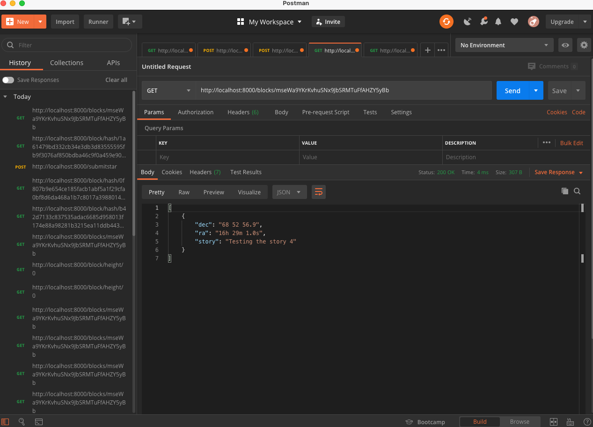

# Requirements

Download project 

cd into project directory

npm install dependencies

node app.js to run application

# Complete unfinished block.js implementation

Implemented `validate()` and `getBData()` under `block.js`

# Complete unfinished blockchain.js implementation

Implemented `_addBlock(block)`, `requestMessageOwnershipVerification(address)`, `submitStar(address, message, signature, star)`, `getBlockHeight(hash)`, `getStarsByWalletAddress(address)` and `validateChain()` under `blockchain.js`

Added `validateChain()` to `_addBlock()` based on rubrics requirements.

Created `validateChain()` trigger with endpoint http://localhost:8000/validateChain

Demonstration - errorLog empty = valid chain

# Test your App functionality

* must use a GET call to request the Genesis block

* must use a POST call to requestValidation

* must sign message with your wallet

* must submit your Star

* must use GET call to retrieve starts owned by a particular address

